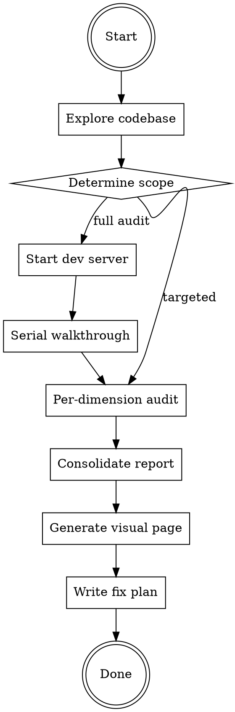

# 体验走查

Playwright 实机走查 + Nielsen 启发式评估，系统化发现 Web/PWA 应用的体验问题。

## Overview

用真实浏览器打开每个页面，像用户一样操作，按 Nielsen 10 大可用性原则逐项评估。产出按严重程度分级的可执行修复清单。

**核心原则：** 自动化工具（Lighthouse、axe）能查的都查过了也未必找得到的问题——状态不一致、交互死角、微妙的视觉偏差、移动端手感——才是这个 skill 要找的。

## When to Use

- 用户说"走查"、"体验审计"、"UX review"、"检查各页面体验"
- 产品开发到一定阶段，想全面打磨体验
- 新功能上线前的体验把关
- 设计系统对照审计（参考 claude-design-style）

## When NOT to Use

- 纯代码逻辑 bug（用 systematic-debugging）
- 只需要检查无障碍（直接跑 axe/Lighthouse）
- 纯性能优化（用 Lighthouse Performance）

## Workflow



## Phase 1: 探索项目上下文

用 Explore agent 了解：
- 框架/路由/页面清单
- 组件库和设计系统现状（CSS Token、主题、断点）
- PWA 配置（SW、manifest）
- 已有的错误处理/加载状态/无障碍实现

**产出：** 页面清单 + 技术栈摘要 + 当前设计成熟度评分

## Phase 2: 确定走查范围

根据项目规模选择模式：

| 项目规模 | 页面数 | 推荐模式 |
|---------|-------|---------|
| 小型 | <5 页 | 单 Agent 全量走查 |
| 中型 | 5-15 页 | 3 Agent 串行走查（见维度分工） |
| 大型 | >15 页 | 5 Agent 串行走查（完整 Nielsen） |

**关键决策：用户是否关注所有维度？** 用 AskUserQuestion 确认重点。

## Phase 3: 串行 Playwright 走查

### 核心规则：一次只有一个 Agent 操作浏览器

> **踩坑经验：** 多个 Agent 共享 Playwright 浏览器会互相干扰——一个在 resize 手机视口，另一个在截桌面端的图。**必须串行**，每个 Agent 用完后关闭或让出浏览器。

### 走查维度分工

完整 Nielsen 10 原则映射为 5 个审计维度：

| 维度 | Nielsen 原则 | 审查重点 |
|------|------------|---------|
| A 状态反馈 | H1 状态可见 + H5 错误预防 | 加载态、同步态、保存反馈、离线指示、表单校验 |
| B 导航心智 | H2 现实匹配 + H6 识别非回忆 + H7 灵活高效 | 信息架构、Tab/路由、搜索、快捷键、术语一致 |
| C 视觉一致 | H4 一致性 + H8 极简美学 | Token 使用率、间距/圆角/颜色一致性、CSS 代码审计 |
| D 错误恢复 | H3 控制自由 + H9 错误恢复 + H10 帮助 | 撤销、错误消息、空状态、引导、帮助文档 |
| E 移动 PWA | H3+H4+H7 移动视角 | 触摸目标、手势、离线体验、键盘适配、安全区域 |

### 每个维度的走查循环

```
对于每个页面:
  对于每个视口 (Desktop 1280×800, Mobile 375×812, [可选 Tablet 768×1024]):
    对于每个状态 (正常, 空, 加载, 错误):
      1. browser_navigate → 页面
      2. browser_resize → 视口
      3. 触发目标状态
      4. browser_snapshot → 分析可访问性树
      5. browser_take_screenshot → 截图存证
      6. 按维度 checklist 逐项评估
      7. 记录发现
```

### Agent 执行模板

每个走查 Agent 的 prompt 应包含：
1. 具体负责的 Nielsen 原则和 checklist（从 references/nielsen-checklist.md 加载）
2. 负责的页面列表和视口
3. Dev server 地址
4. 发现输出格式（从 references/finding-template.md 加载）

## Phase 4: 汇总去重

Team Lead（或单 Agent 模式下的主 Agent）汇总所有发现：

1. **去重** — 多个维度从不同角度发现的同一根因合并
2. **交叉验证** — 统一严重程度评级
3. **模式识别** — 归类共同根因（如"所有 Token 使用率低"是一个系统性问题）

## Phase 5: 产出

### 1. Markdown 报告
保存到 `docs/ux-audit-report.md`，结构：
- 执行摘要（统计 + Top 5）
- 按严重程度分级的发现列表
- CSS/设计系统改进建议（如适用）
- 做得好的方面
- 推荐修复路线

### 2. 可视化网页（可选）
使用 output-webpage skill 生成 `public/ux-audit.html`，用大白话解释每个发现。

### 3. 修复计划（可选）
使用 writing-plans skill 产出按 Agent 文件归属分工的实施计划。

## 严重程度分级

| 级别 | 标准 | 例子 |
|------|------|------|
| Critical | 阻断核心任务或导致数据丢失 | 页面崩溃、静默保存失败、核心按钮功能错误 |
| Major | 显著困惑或工作流中断 | 导航不一致、3s+ 无加载指示、错误消息不可理解 |
| Minor | 可感知的摩擦但有变通方案 | 间距不一致、缺失 tooltip、暗色模式小瑕疵 |
| Enhancement | 做了会更好的优化 | 微动画、快捷键增强、阅读进度条 |

## 常见踩坑 & 对策

| 踩坑 | 对策 |
|------|------|
| 多 Agent 同时操作 Playwright 导致串台 | **必须串行**，一个 Agent 完成后下一个才开始 |
| 走查发现是 PWA 缓存问题而非代码 bug | 先确认 dev 环境下 SW 是否禁用，或用隐身模式 |
| CSS 审计只看代码不看实际渲染 | 必须结合 Playwright 截图 + 代码审计 |
| 报告写满技术术语用户看不懂 | 生成可视化网页时用大白话和生活化类比 |
| Agent Team 关不掉 | 审计完立刻 shutdown 所有 Agent，不要等到最后 |
| 走查覆盖不全漏掉页面 | Phase 1 必须列出完整页面清单并确认 |

## 与其他 Skill 的联动

- **claude-design-style** — 视觉维度(C)对照 Anthropic 设计标准
- **output-webpage** — 将报告生成可读的 HTML 页面
- **writing-plans** — 将修复项转化为可执行的实施计划
- **subagent-driven-development** — 并行执行修复任务
- **systematic-debugging** — 对 Critical bug 进行根因分析
