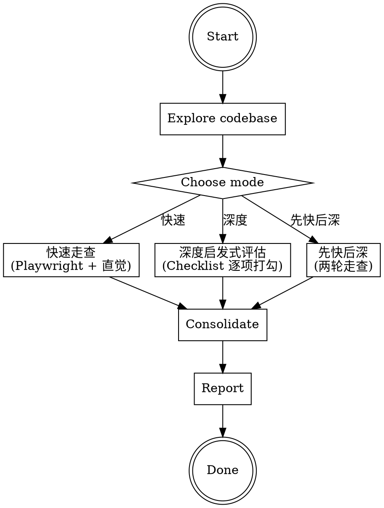

# 体验走查

Playwright 实机走查 + Nielsen 启发式评估，系统化发现 Web/PWA 应用的体验问题。

## Overview

用真实浏览器打开每个页面，像用户一样操作，发现自动化工具查不到的体验问题——状态不一致、交互死角、微妙的视觉偏差、移动端手感。

**两种走查模式：**
- **快速走查** — Playwright 实机操作 + 直觉驱动发现，事后用 Nielsen 分类。速度快、覆盖广，适合"先扫一遍找大问题"
- **深度启发式评估** — 拿着 Nielsen checklist 逐项打勾，每个页面 × 每条原则。慢但系统，不遗漏盲区，适合"精细打磨"

## When to Use

- 用户说"走查"、"体验审计"、"UX review"、"检查各页面体验"
- 产品开发到一定阶段，想全面打磨体验
- 新功能上线前的体验把关
- 设计系统对照审计（参考 claude-design-style）

## When NOT to Use

- 纯代码逻辑 bug（用 systematic-debugging）
- 只需要检查无障碍（直接跑 axe/Lighthouse）
- 纯性能优化（用 Lighthouse Performance）

## Phase 0: 选择走查模式

用 AskUserQuestion 让用户选择：

```
┌─────────────────────────────────────────────┐
│ 快速走查（推荐首次使用）                        │
│ Playwright 打开每个页面，凭经验找问题，           │
│ 事后用 Nielsen 原则分类。                       │
│ 速度快、覆盖广，适合先扫一遍找大问题              │
├─────────────────────────────────────────────┤
│ 深度启发式评估                                 │
│ 拿着 Nielsen 10 条原则的 checklist，            │
│ 对每个页面逐项问"符不符合这条？"                  │
│ 慢但系统，确保不遗漏盲区                         │
├─────────────────────────────────────────────┤
│ 先快后深（最全面）                              │
│ 先快速走查找显性问题，再深度评估找盲区             │
│ 两轮下来覆盖最全面                              │
└─────────────────────────────────────────────┘
```

## Workflow



---

## Phase 1: 探索项目上下文

用 Explore agent 了解：
- 框架/路由/页面清单
- 组件库和设计系统现状（CSS Token、主题、断点）
- PWA 配置（SW、manifest）
- 已有的错误处理/加载状态/无障碍实现

**产出：** 页面清单 + 技术栈摘要 + 当前设计成熟度评分

## Phase 2: 确定走查范围

根据项目规模选择 Agent 数量：

| 项目规模 | 页面数 | 推荐 Agent 数 |
|---------|-------|-------------|
| 小型 | <5 页 | 1 个 Agent 全量走查 |
| 中型 | 5-15 页 | 3 个 Agent 串行（合并维度） |
| 大型 | >15 页 | 5 个 Agent 串行（完整 5 维度） |

用 AskUserQuestion 确认用户关注的重点维度。

---

## Phase 3A: 快速走查模式

### 核心规则：一次只有一个 Agent 操作浏览器

> **踩坑经验：** 多个 Agent 共享 Playwright 浏览器会互相干扰——一个在 resize 手机视口，另一个在截桌面端的图。**必须串行**，每个 Agent 用完后关闭或让出浏览器。

### 走查方法

每个 Agent 负责一组维度，按以下循环操作：

```
对于每个页面:
  对于每个视口 (Desktop 1280×800, Mobile 375×812):
    1. browser_navigate → 页面
    2. browser_resize → 视口
    3. browser_snapshot → 分析可访问性树
    4. browser_take_screenshot → 截图
    5. 像用户一样操作：点击、输入、切换、返回
    6. 发现"不对劲"的地方 → 记录
    7. 事后标注对应的 Nielsen 原则
```

### 走查维度分工

| 维度 | Nielsen 原则 | 审查重点 |
|------|------------|---------|
| A 状态反馈 | H1 + H5 | 加载态、同步态、保存反馈、离线指示、表单校验 |
| B 导航心智 | H2 + H6 + H7 | 信息架构、Tab/路由、搜索、快捷键、术语一致 |
| C 视觉一致 | H4 + H8 | Token 使用率、间距/圆角/颜色一致性、CSS 代码审计 |
| D 错误恢复 | H3 + H9 + H10 | 撤销、错误消息、空状态、引导、帮助文档 |
| E 移动 PWA | H3+H4+H7 移动视角 | 触摸目标、手势、离线体验、键盘适配、安全区域 |

### 快速走查的优势和局限

- **优势：** 快、能发现显性问题（崩溃、功能错误、明显的视觉问题）
- **局限：** 依赖走查者的经验和注意力，容易遗漏"没触发到"的问题（比如你恰好没测试空状态，就不会发现空状态的问题）

---

## Phase 3B: 深度启发式评估模式

### 方法：Checklist 驱动，不依赖直觉

每个 Agent 负责 2-3 个 Nielsen 原则，对每个页面**逐项回答 checklist 里的每个问题**。

### 执行流程

```
对于分配给自己的每条 Nielsen 原则:
  对于 checklist 里的每个检查项:
    对于每个页面:
      打开页面 → 检查这一项是否满足 → 记录 ✅ 或 ❌ + 原因
```

**关键区别：** 不是"打开页面看看有什么问题"，而是"拿着第 3 条检查项，去每个页面验证它"。

### Checklist 来源

加载 `references/nielsen-checklist.md`，按原则逐项执行。

### 产出格式

除了发现卡片（同快速走查），还需要输出**合规矩阵**：

```markdown
| 页面 | H1-加载状态 | H1-同步状态 | H1-保存反馈 | H1-离线指示 | ... |
|------|-----------|-----------|-----------|-----------|-----|
| Wiki Tab | ✅ | ⚠️ 无时间戳 | ✅ | ✅ | ... |
| Ask Tab  | ❌ 无skeleton | N/A | ✅ | ✅ | ... |
| /sync    | ✅ | ❌ 裸文本 | N/A | ⚠️ | ... |
```

### 深度评估的优势和局限

- **优势：** 系统不遗漏、能发现"你根本不会想到去测"的盲区（如"最近访问功能缺失"）
- **局限：** 慢、很多检查项对特定页面不适用（N/A 多）、可能产出大量 Minor 级别的发现

---

## Phase 3C: 先快后深模式

1. 先跑一轮**快速走查**，找出所有 Critical 和 Major
2. 汇总快速走查发现
3. 分析哪些 Nielsen 原则**没有在快速走查中被充分覆盖**
4. 针对覆盖不足的原则，跑**深度启发式评估**
5. 合并两轮发现

这是覆盖最全面的模式，但也最耗时间。

---

## Phase 4: 汇总去重

1. **去重** — 多个维度从不同角度发现的同一根因合并
2. **交叉验证** — 统一严重程度评级
3. **模式识别** — 归类共同根因（如"所有 Token 使用率低"是一个系统性问题）
4. **合规覆盖检查**（深度模式）— 确认 10 条原则都被评估到了

## Phase 5: 产出

### 1. Markdown 报告
保存到 `docs/ux-audit-report.md`，结构：
- 执行摘要（统计 + Top 5）
- 按严重程度分级的发现列表
- 合规矩阵（深度模式产出）
- CSS/设计系统改进建议（如适用）
- 做得好的方面
- 推荐修复路线

### 2. 可视化网页（可选）
使用 output-webpage skill 生成可读的 HTML 页面，用大白话解释每个发现。

### 3. 修复计划（可选）
使用 writing-plans skill 产出按文件归属分工的实施计划。

## 严重程度分级

| 级别 | 标准 | 例子 |
|------|------|------|
| Critical | 阻断核心任务或导致数据丢失 | 页面崩溃、静默保存失败、核心按钮功能错误 |
| Major | 显著困惑或工作流中断 | 导航不一致、3s+ 无加载指示、错误消息不可理解 |
| Minor | 可感知的摩擦但有变通方案 | 间距不一致、缺失 tooltip、暗色模式小瑕疵 |
| Enhancement | 做了会更好的优化 | 微动画、快捷键增强、阅读进度条 |

## 常见踩坑 & 对策

| 踩坑 | 对策 |
|------|------|
| 多 Agent 同时操作 Playwright 导致串台 | **必须串行**，一个 Agent 完成后下一个才开始 |
| 走查发现是 PWA 缓存问题而非代码 bug | 先确认 dev 环境下 SW 是否禁用，或用隐身模式 |
| CSS 审计只看代码不看实际渲染 | 必须结合 Playwright 截图 + 代码审计 |
| 报告写满技术术语用户看不懂 | 生成可视化网页时用大白话和生活化类比 |
| Agent Team 关不掉 | 审计完立刻 shutdown 所有 Agent，不要等到最后 |
| 走查覆盖不全漏掉页面 | Phase 1 必须列出完整页面清单并确认 |
| 快速走查遗漏系统性盲区 | 快速走查后检查哪些 Nielsen 原则没被覆盖，补跑深度评估 |
| Nielsen 变成事后贴标签 | 深度模式下必须先读 checklist 条目再去页面验证，不能先看页面再贴原则 |

## 与其他 Skill 的联动

- **claude-design-style** — 视觉维度(C)对照 Anthropic 设计标准
- **output-webpage** — 将报告生成可读的 HTML 页面
- **writing-plans** — 将修复项转化为可执行的实施计划
- **subagent-driven-development** — 并行执行修复任务
- **systematic-debugging** — 对 Critical bug 进行根因分析
