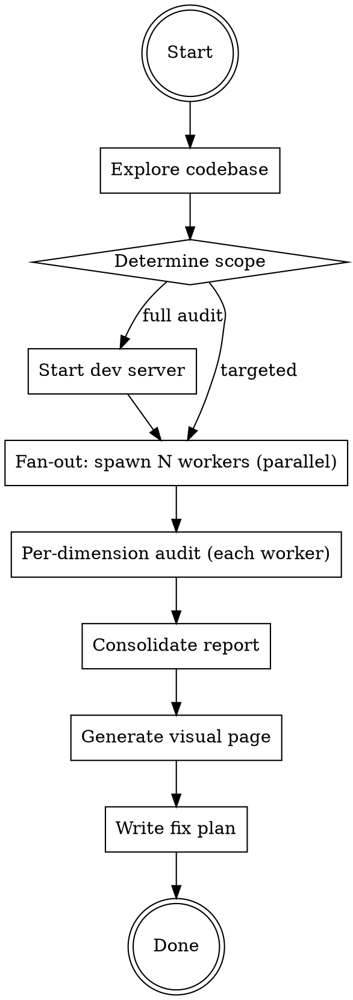

# 体验走查

Playwright 实机走查 + Nielsen 启发式评估，**多子代理并行**走查 Web/PWA 的体验问题。

## Overview

用真实浏览器打开每个页面，像用户一样操作，按 Nielsen 10 大可用性原则逐项评估。把 10 条原则按职责拆成 5 个维度，每个维度由一个 **`ux-walkthrough-worker`** 子代理负责，子代理之间**并行**执行（每个子代理拥有自己独立的浏览器实例）。主代理只做范围决策、汇总去重、产出报告。

**核心原则：** 自动化工具（Lighthouse、axe）能查的都查过了也未必找得到的问题——状态不一致、交互死角、微妙的视觉偏差、移动端手感——才是这个 skill 要找的。

## When to Use

- 用户说"走查"、"体验审计"、"UX review"、"检查各页面体验"
- 产品开发到一定阶段，想全面打磨体验
- 新功能上线前的体验把关
- 设计系统对照审计

## When NOT to Use

- 纯代码逻辑 bug（先做 debugging）
- 只需要检查无障碍（直接跑 axe/Lighthouse）
- 纯性能优化（用 Lighthouse Performance）

## Workflow



## Phase 1: 探索项目上下文

主代理用 Grep / Glob / Read（必要时配合 `worker` 子代理做大范围 explore）了解：

- 框架/路由/页面清单
- 组件库和设计系统现状（CSS Token、主题、断点）
- PWA 配置（SW、manifest）
- 已有的错误处理/加载状态/无障碍实现

**产出：** 页面清单 + 技术栈摘要 + 当前设计成熟度评分。

## Phase 2: 确定走查范围

根据项目规模选择并行宽度：

| 项目规模 | 页面数 | 并行 worker 数 | 备注 |
|---------|-------|--------------|------|
| 小型 | <5 页 | 1 个 worker | 单代理跑全部 5 维度，省成本 |
| 中型 | 5–15 页 | **3 个 worker 并行** | 合并维度：A+E、B、C+D |
| 大型 | >15 页 | **5 个 worker 并行** | 每个 worker 负责一个完整 Nielsen 维度 |

**关键决策：用户是否关注所有维度？** 用 `AskUser` 工具确认重点。

## Phase 3: 并行 Playwright 走查

### 核心规则：每个子代理拥有独立浏览器实例

> **架构前提：** `ux-walkthrough-worker` 子代理通过 `Task` 工具拉起时，每次调用是独立 stateless 进程，会各自启动自己的 Playwright/agent-browser 实例，**不共享浏览器**。因此**可以并行**执行，主代理在同一条消息里 fan-out 多个 `Task` 调用即可。
>
> **只有同一个 worker 内部**要保证浏览器操作严格串行（自己别开多 tab 抢自己的状态）。

### 走查维度分工

完整 Nielsen 10 原则映射为 5 个审计维度（与 `ux-walkthrough-worker` 系统提示一致）：

| 维度 | Nielsen 原则 | 审查重点 |
|------|------------|---------|
| A 状态反馈 | H1 状态可见 + H5 错误预防 | 加载态、同步态、保存反馈、离线指示、表单校验 |
| B 导航心智 | H2 现实匹配 + H6 识别非回忆 + H7 灵活高效 | 信息架构、Tab/路由、搜索、快捷键、术语一致 |
| C 视觉一致 | H4 一致性 + H8 极简美学 | Token 使用率、间距/圆角/颜色一致性、CSS 代码审计 |
| D 错误恢复 | H3 控制自由 + H9 错误恢复 + H10 帮助 | 撤销、错误消息、空状态、引导、帮助文档 |
| E 移动 PWA | H3+H4+H7 移动视角 | 触摸目标、手势、离线体验、键盘适配、安全区域 |

### 每个 worker 的走查循环

```
对于每个页面:
  对于每个视口 (Desktop 1280×800, Mobile 375×812, [可选 Tablet 768×1024]):
    对于每个状态 (正常, 空, 加载, 错误):
      1. 导航到页面             (agent-browser skill)
      2. 调整视口                (agent-browser skill)
      3. 触发目标状态
      4. 抓取可访问性 snapshot
      5. 截图存证 tmp/ux-audit/<维度>/<页>-<视口>-<状态>.png
      6. 按维度 checklist 逐项评估
      7. 记录发现
```

### 主代理调用模板

主代理在一个消息里**并行**发出多个 `Task` 调用（最多 5 个，对应 5 维度）：

```
Task(
  subagent_type="ux-walkthrough-worker",
  description="UX walk dim A",
  prompt="""
- Dimension: A
- Pages: ["/", "/library", "/ask", ...]
- Viewports: ["desktop", "mobile"]
- States: ["normal", "empty", "loading", "error"]
- Dev server URL: http://localhost:3000
- Reference files:
  - /root/compound/.factory/skills/体验走查/references/nielsen-checklist.md
  - /root/compound/.factory/skills/体验走查/references/finding-template.md
"""
)
```

并行发出 N 个相同结构、不同 `Dimension` 的调用即可。每个 worker 返回结构化 JSON。

## Phase 4: 汇总去重

主代理收齐所有 worker 的 JSON 后：

1. **去重** — 多个维度从不同角度发现的同一根因合并
2. **交叉验证** — 统一严重程度评级
3. **模式识别** — 归类共同根因（如"所有 Token 使用率低"是一个系统性问题）
4. **整理 out-of-scope notes** — worker 在自己维度外观察到的问题挑出来，作为后续走查或修复的备忘

## Phase 5: 产出

### 1. Markdown 报告
保存到 `docs/ux-audit-report.md`，结构：
- 执行摘要（统计 + Top 5）
- 按严重程度分级的发现列表
- CSS/设计系统改进建议（如适用）
- 做得好的方面
- 推荐修复路线

### 2. 可视化网页（可选）
生成 `public/ux-audit.html`，用大白话解释每个发现（生活化类比，少术语）。

### 3. 修复计划（可选）
按文件/组件归属拆分修复项，再用 `Task subagent_type="worker"` 并行执行。

## 严重程度分级

| 级别 | 标准 | 例子 |
|------|------|------|
| Critical | 阻断核心任务或导致数据丢失 | 页面崩溃、静默保存失败、核心按钮功能错误 |
| Major | 显著困惑或工作流中断 | 导航不一致、3s+ 无加载指示、错误消息不可理解 |
| Minor | 可感知的摩擦但有变通方案 | 间距不一致、缺失 tooltip、暗色模式小瑕疵 |
| Enhancement | 做了会更好的优化 | 微动画、快捷键增强、阅读进度条 |

## 常见踩坑 & 对策

| 踩坑 | 对策 |
|------|------|
| worker 之间状态串台 | **不会发生**，每个 worker 是独立 Task 调用、独立浏览器实例；只要每个 worker 内部不开多 tab 抢自己的状态 |
| dev server 被 N 个 worker 压垮 | 中型项目控制在 3 并行；大型项目 5 并行已是上限，再多就分批 |
| 走查发现是 PWA 缓存问题而非代码 bug | 在每个 worker 的 prompt 里要求关 SW 或用隐身模式 |
| CSS 审计只看代码不看实际渲染 | C 维度 worker 必须结合截图 + 代码 grep 双向验证 |
| 报告写满技术术语用户看不懂 | 生成可视化网页时用大白话和生活化类比 |
| 走查覆盖不全漏掉页面 | Phase 1 必须列出完整页面清单并用 `AskUser` 确认 |
| 项目级 `.factory/droids/` 在当前会话拉不起 worker | 把 droid 文件同时放到 `~/.factory/droids/`，或重启 CLI 让项目目录被扫描 |

## 依赖

- **`ux-walkthrough-worker`** 子代理 — 定义在 `.factory/droids/ux-walkthrough-worker.md`（model: `kimi-k2.6`），由本 skill 通过 `Task` 工具拉起。
- **`agent-browser`** skill（个人级）— worker 进行浏览器自动化的首选；不可用时回退到 `Execute` 调用 Playwright。
- **`references/nielsen-checklist.md`** — 维度 checklist，worker 启动时读取。
- **`references/finding-template.md`** — 发现输出模板，worker 启动时读取。
