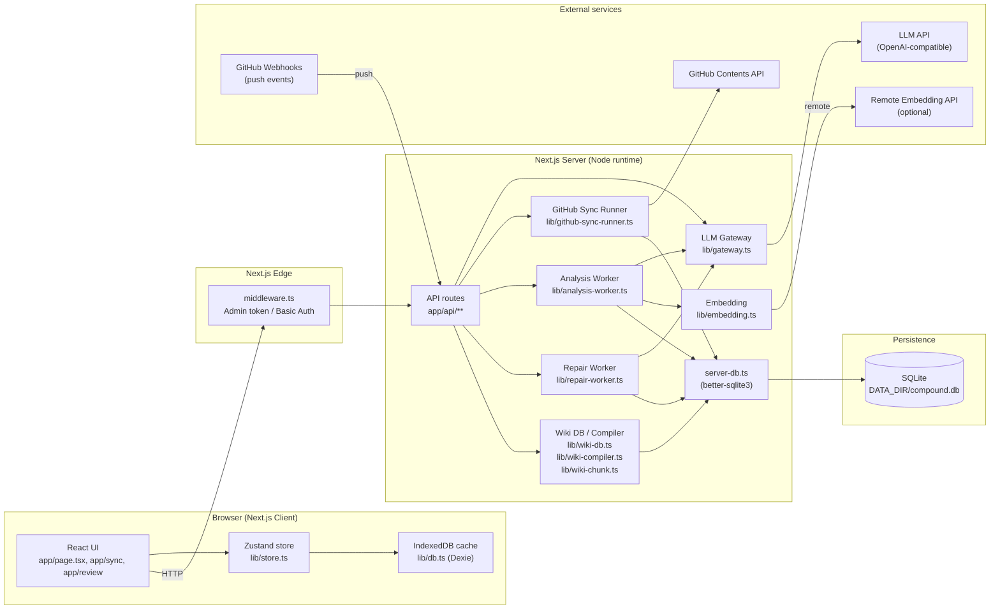
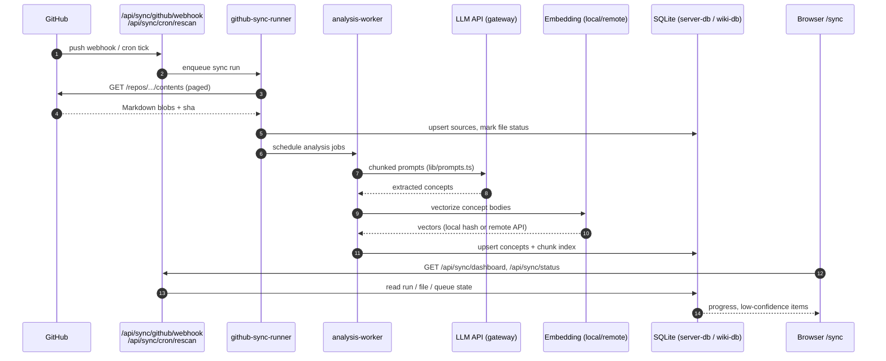
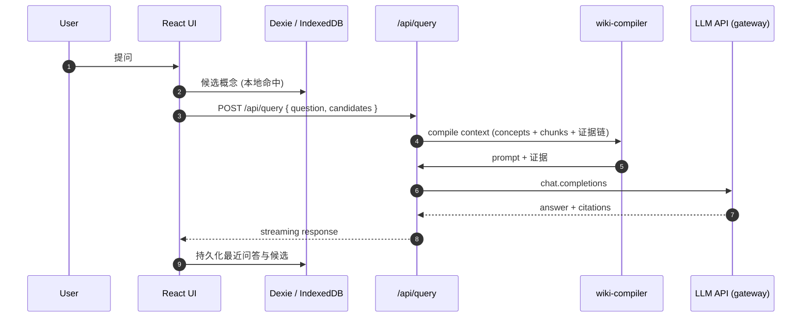
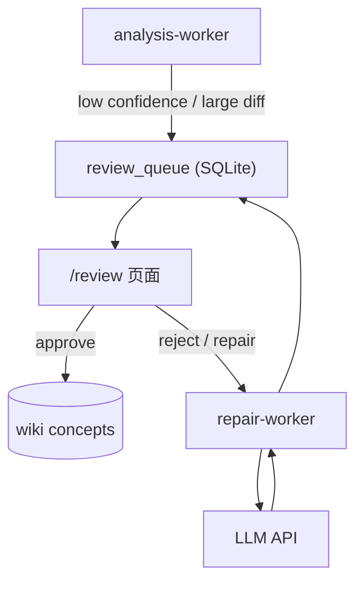
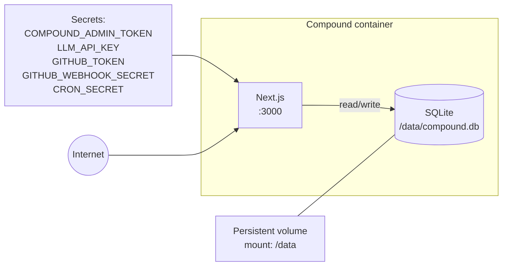

# Compound 架构文档 / Architecture

本文档描述 Compound 的运行时架构、组件依赖、外部服务调用与关键数据流。
图均使用 [Mermaid](https://mermaid.js.org/)，可在 GitHub、VS Code（带插件）或任何 Mermaid 兼容渲染器中查看。

## 1. 系统总览

Compound 是一个基于 Next.js 15 (App Router) 的私人 LLM 知识 Wiki。所有
访问都先经过 `middleware.ts` 中的 admin token 校验；浏览器侧用 Dexie /
IndexedDB 做本地缓存，服务端用 `better-sqlite3` 在 `DATA_DIR` 持久化所有概念、
来源与同步任务。

## 2. 进程与运行时

| 进程 / 运行时      | 入口                                                                          | 说明                                                                                                                                       |
| ------------------ | ----------------------------------------------------------------------------- | ------------------------------------------------------------------------------------------------------------------------------------------ |
| Next.js Server     | `next start` (Dockerfile `CMD ["node", "server.js"]`)                         | 同时承载 SSR 页面与 `/api/**` 路由；建议容器化部署而非 serverless（后台 worker 需常驻）。                                                  |
| Edge Middleware    | `middleware.ts`                                                               | 在请求进入 server 之前做 admin token 校验；匹配 `/api/:path*` 与所有非静态资源页面。                                                       |
| Background workers | `lib/github-sync-runner.ts`, `lib/analysis-worker.ts`, `lib/repair-worker.ts` | 通过 `/api/sync/worker`、`/api/repair/run`、`/api/sync/cron/rescan` 等路由触发，状态写入 SQLite，UI 通过 `/sync` 与 `/review` 仪表盘观察。 |
| Browser client     | `app/page.tsx` 等 RSC + Client Components                                     | 通过 Zustand 维护 UI 状态，通过 Dexie 在 IndexedDB 中缓存概念，离线/弱网下可读。                                                           |

## 3. 关键依赖

### 3.1 外部服务

| 服务                       | 调用方                                                             | 鉴权 / 配置                                                                              | 用途                                                                                   |
| -------------------------- | ------------------------------------------------------------------ | ---------------------------------------------------------------------------------------- | -------------------------------------------------------------------------------------- |
| OpenAI-compatible LLM      | `lib/gateway.ts`, `lib/analysis-worker.ts`, `lib/repair-worker.ts` | `LLM_API_URL`, `LLM_API_KEY`, `LLM_MODEL`；`COMPOUND_LLM_RATE_LIMIT_PER_MINUTE` 控制限流 | 概念抽取、问答、重排、修复。Gateway 对私网/元数据地址做 SSRF 过滤。                    |
| 远程 Embedding API（可选） | `lib/embedding.ts`                                                 | `COMPOUND_EMBEDDING_PROVIDER=remote` + `COMPOUND_EMBEDDING_API_URL/KEY/MODEL`            | 远程向量化；默认使用本地哈希向量，`COMPOUND_DISABLE_HYBRID_SEARCH=true` 可强制走 FTS。 |
| GitHub Contents API        | `lib/github-sync-client.ts`, `lib/github-sync-runner.ts`           | `GITHUB_REPO`, `GITHUB_TOKEN` (fine-grained PAT, Contents: Read), `GITHUB_BRANCH`        | 拉取 Markdown 笔记仓库；`COMPOUND_SYNC_RATE_LIMIT_PER_MINUTE` 控制并发节奏。           |
| GitHub Webhooks            | `app/api/sync/github/webhook`                                      | `GITHUB_WEBHOOK_SECRET` 校验签名                                                         | 接收 push 事件触发增量同步。                                                           |
| Cron 调度（外部触发）      | `app/api/sync/cron/rescan`                                         | `CRON_SECRET` 头部鉴权                                                                   | 定时全量重扫，例如部署平台的定时任务。                                                 |

### 3.2 内部库依赖

| 模块                                                            | 主要职责                                                                 | 依赖                                                                        |
| --------------------------------------------------------------- | ------------------------------------------------------------------------ | --------------------------------------------------------------------------- |
| `lib/server-db.ts`                                              | 打开 / 迁移 SQLite，封装 concepts、sources、sync_runs、review_queue 等表 | `better-sqlite3`, `DATA_DIR`                                                |
| `lib/server-auth.ts`                                            | 服务端 admin token 验证、子路径白名单                                    | `process.env`，与 `middleware.ts` 共享 token                                |
| `lib/gateway.ts`                                                | LLM 转发、SSRF 防护、超时与限流                                          | Node `dns/net`、`lib/rate-limit.ts`、`lib/model-runs.ts`                    |
| `lib/github-sync-*`                                             | 拉取、分页、断点续传、删除模式（soft/hard）                              | GitHub Contents API                                                         |
| `lib/analysis-worker.ts`                                        | 把 Markdown 切块 → 概念抽取 → 写入 Wiki DB                               | `lib/wiki-chunk.ts`, `lib/wiki-db.ts`, `lib/embedding.ts`, `lib/gateway.ts` |
| `lib/repair-worker.ts`                                          | 低置信度概念的二次修复，写入 review queue                                | `lib/review-queue.ts`, `lib/gateway.ts`                                     |
| `lib/wiki-db.ts` / `lib/wiki-compiler.ts` / `lib/wiki-chunk.ts` | 概念分块、检索（FTS + 向量）、证据链编译                                 | `better-sqlite3`, `lib/embedding.ts`                                        |
| `lib/db.ts`                                                     | 浏览器侧 Dexie 数据库（IndexedDB）镜像                                   | `dexie`, `dexie-react-hooks`                                                |
| `lib/store.ts`                                                  | 浏览器全局状态（Zustand）                                                | `zustand`                                                                   |

## 4. 主要数据流

### 4.1 GitHub 同步 → 概念抽取

从 push 事件或定时任务开始，最终把概念写入 SQLite，再分发到 Wiki 索引与浏览器缓存。

### 4.2 浏览器问答（Query）

### 4.3 评审与修复闭环

## 5. 端口、卷、密钥

> 部署要点：
>
> - 必须配置 `COMPOUND_ADMIN_TOKEN`（生产环境 middleware 会在缺失时直接返回 503）。
> - `DATA_DIR` 必须挂到持久卷，否则容器重启会丢失 Wiki。
> - 容器要长驻运行（不要 serverless），因为同步与分析 worker 是有状态的后台任务。

## 6. 部署观测与告警

部署影响要从四层同时看：部署平台、错误追踪、指标面板、应用内任务状态。
完整运行手册见 [`docs/deployment-observability.md`](deployment-observability.md)。

| 层级           | 入口                                                                                                                                                                                                                                                                   | 用途                                                                                          |
| -------------- | ---------------------------------------------------------------------------------------------------------------------------------------------------------------------------------------------------------------------------------------------------------------------- | --------------------------------------------------------------------------------------------- |
| 部署平台       | [Zeabur Projects](https://dash.zeabur.com/projects)                                                                                                                                                                                                                    | 查看最近一次部署、构建日志、运行日志、重启次数、CPU / 内存、`/data` 卷挂载。                  |
| 错误与性能     | [Sentry Issues](https://sentry.io/issues/)、[Sentry Performance](https://sentry.io/performance/)                                                                                                                                                                       | 按 `SENTRY_RELEASE` 看新错误、请求 trace、source map 后的真实堆栈。                           |
| 指标面板       | `GET /api/metrics`，接入 [Grafana](https://grafana.com/docs/grafana/latest/dashboards/)、[Datadog OpenMetrics](https://docs.datadoghq.com/integrations/openmetrics/) 或 [New Relic Prometheus](https://docs.newrelic.com/docs/infrastructure/prometheus-integrations/) | 观察 5xx、p95 延迟、进程 uptime、内存、同步失败、分析队列、review queue、embedding fallback。 |
| 应用内实时状态 | `/api/health`、`/api/wiki/health`、`/sync`、`/review`                                                                                                                                                                                                                  | 验证生产配置、Wiki 索引覆盖度、GitHub 同步进度、分析 worker 状态、人工评审压力。              |
| 部署通知       | Zeabur 项目通知，或 GitHub Actions + [`SLACK_WEBHOOK_URL`](https://api.slack.com/messaging/webhooks)                                                                                                                                                                   | 每次部署把环境、commit、部署链接、健康检查、`/sync` 链接和 Sentry release 链接发到 Slack。    |

## 7. API 路由地图

| 路径                                   | 方法     | 说明                                     |
| -------------------------------------- | -------- | ---------------------------------------- |
| `/api/health`                          | GET      | 健康检查（无鉴权依赖处可探活）           |
| `/api/metrics`                         | GET      | Prometheus 指标（需 admin token）        |
| `/api/lint`                            | POST     | 内置 lint pipeline，给概念体做格式化校验 |
| `/api/ingest`                          | POST     | 直接摄入用户粘贴 / 上传的 Markdown       |
| `/api/categorize`                      | POST     | 概念分类规范化                           |
| `/api/query`                           | POST     | 问答 + 证据链                            |
| `/api/wiki/search`                     | POST     | FTS / 混合检索                           |
| `/api/wiki/export`                     | GET      | 导出当前 Wiki                            |
| `/api/wiki/health`                     | GET      | Wiki 索引覆盖度                          |
| `/api/wiki/rebuild-index`              | POST     | 重建分块索引                             |
| `/api/data/concepts`                   | GET/POST | 概念 CRUD                                |
| `/api/data/sources`                    | GET      | 文件来源                                 |
| `/api/data/snapshot`                   | GET      | 全量快照（浏览器同步用）                 |
| `/api/sync/github/list`                | GET      | 列出 GitHub 仓库内容                     |
| `/api/sync/github/content`             | GET      | 拉取单文件                               |
| `/api/sync/github/run`                 | POST     | 触发一次同步                             |
| `/api/sync/github/webhook`             | POST     | 接收 GitHub push                         |
| `/api/sync/cron/rescan`                | POST     | 定时全量重扫（需 `CRON_SECRET`）         |
| `/api/sync/dashboard`                  | GET      | 仪表盘聚合数据                           |
| `/api/sync/status`                     | GET      | 当前 run 状态                            |
| `/api/sync/retry` / `/api/sync/cancel` | POST     | 重试 / 取消                              |
| `/api/sync/worker`                     | POST     | 推动 worker tick                         |
| `/api/repair/run`                      | POST     | 触发修复 worker                          |
| `/api/repair/status`                   | GET      | 修复进度                                 |
| `/api/review/queue`                    | GET/POST | 人工评审队列                             |
| `/api/settings/models`                 | GET/POST | LLM 模型选择历史                         |

## 8. 故障与回退路径

| 故障                  | 行为                                                                                                  |
| --------------------- | ----------------------------------------------------------------------------------------------------- |
| LLM API 不可达 / 超时 | `lib/gateway.ts` 触发限流 + 错误码透传；`analysis-worker` 把任务标记为 `failed`，UI 上可重试。        |
| 远程 embedding 失败   | `lib/embedding.ts` 自动回退到本地哈希向量，必要时通过 `COMPOUND_DISABLE_HYBRID_SEARCH` 关闭向量检索。 |
| GitHub 限流 / 401     | sync runner 在 SQLite 中记录失败原因，`/sync` 页可看到红色错误并支持手动重试。                        |
| SQLite 写入失败       | 抛出错误并保持事务，外层 API 返回 5xx；建议监控容器日志与磁盘容量。                                   |
| Admin token 缺失      | 生产环境 middleware 返回 503，开发环境放行（仅本地开发）。                                            |

---

> 维护提示：当新增 API 路由、外部服务或后台 worker 时，请同步更新本文件中的总览图、API 路由表与故障表。
